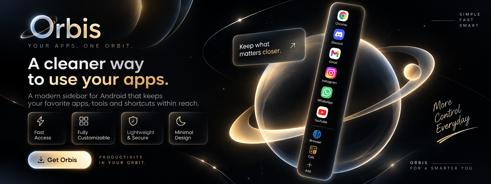
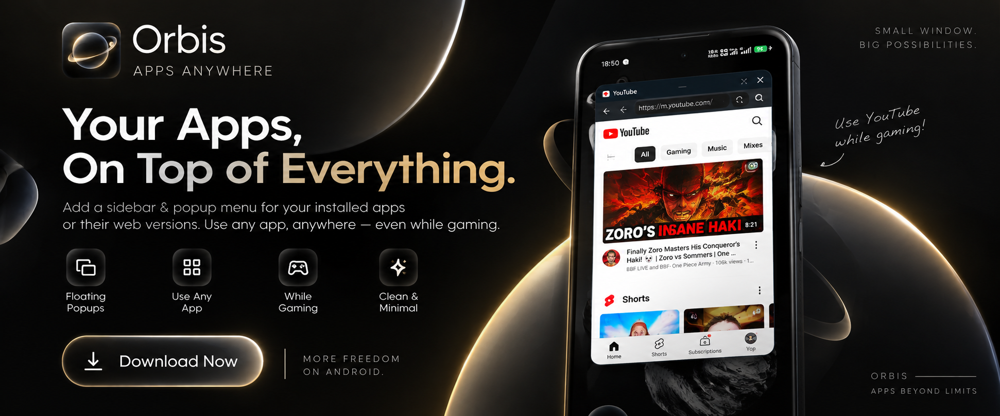

  

  
  
  
  
  

  

> **Your Apps, On Top of Everything.** Orbis is a lightweight, high-performance floating workspace and edge sidebar for Android that lets you run web apps, floating tools, and native applications in resizable overlay windows above your games, videos, and daily apps.

---

## 🎮 Multitasking Anywhere — Even While Gaming

  

---

## ✨ Features

- **🚀 Floating Sidebar Overlay**: A minimalist magnetic dock handle docked to the edge of your screen. One tap opens your favorite pinned apps, tools, and web apps anywhere on Android.
- **🎮 Adaptive 16:9 Landscape Mode**: Playing horizontal games like **Free Fire, BGMI, Call of Duty, or Asphalt**? Orbis automatically detects landscape mode and launches floating windows in a widescreen 16:9 format without awkward vertical letterboxing.
- **📱 1-Tap Aspect Ratio Toggle**: Instantly switch any floating window between **9:16 Portrait Mode** (for quick chats and feeds) and **16:9 Landscape Mode** (for widescreen productivity and media) using the header bar 🔄 button.
- **🌐 Desktop Mode & Horizontal Pan**: 1-tap Desktop Site toggle in the browser URL bar. View WhatsApp Web, GitHub code repositories, and wide desktop tables with smooth horizontal scrolling and pinch-to-zoom.
- **🗕 Auto-Minimize on Outside Tap**: Tap anywhere outside the floating window to instantly collapse it into a floating bubble without interrupting your background game or video.
- **📐 Proportional Corner Resizing**: Smooth, intuitive resize handles at both bottom corners lock the aspect ratio so your windows always look crisp and perfectly proportioned.
- **🌐 50+ Web Apps Built-in**: Zero-setup mobile & desktop web versions of WhatsApp, Instagram, Discord, YouTube, Telegram, ChatGPT, Reddit, Spotify, Canva, and more.
- **🔐 Shared Login & Ecosystem (SSO)**: Connect your Google Account once, and easily sign into other supported web apps with seamless third-party authentication and OAuth popup support.
- **🧮 Built-in Floating Tools**: Floating Advanced Scientific Calculator (Standard, Scientific fx, and History) and quick search browser.
- **🔄 Instant OTA Updates**: Built-in update detector checks for new versions with 1-tap download and installation.
- **🪶 Ultra-Lightweight & Efficient**: Entire app compiled at just **2.2 MB** with zero bloatware and minimal battery consumption.

---

## 📥 How to Install

1. Go to the [**Latest Releases**](https://github.com/justaxce/Orbis/releases/latest) page.
2. Download `Orbis.apk` directly to your Android device.
3. Open the downloaded file and tap **Install**.  
   *(If prompted by Android, enable **"Allow from this source"** for your browser or file manager).*
4. Open **Orbis** and grant the **"Display over other apps"** (Overlay) permission so the floating sidebar can appear on your screen.
5. Tap the **Toggle Floating Overlay** switch to activate the edge dock handle. You're ready to go!

---

## ⚙️ Requirements

| Requirement | Specification |
| :--- | :--- |
| **Operating System** | Android 8.0 (Oreo / API 26) or higher |
| **Recommended OS** | Android 10, 11, 12, 13, 14+ |
| **Storage Required** | < 5 MB |
| **Core Permission** | `SYSTEM_ALERT_WINDOW` (Display over other apps) |

---

## 💡 Quick Tips

* **Snap to Either Edge**: Drag the sidebar dock handle vertically or drag it across the screen to anchor it to either the left or right edge.
* **Rotate Ratio**: Tap the 🔄 button in the floating window header to flip between vertical phone mode and widescreen monitor mode.
* **Minimize on Demand**: Tap outside the window or tap the 🗕 button in the window header to collapse into a floating bubble. Tap the bubble to restore your session instantly.
* **Desktop Mode**: Tap the desktop icon in the floating browser top bar to switch any webpage to full desktop mode.
* **Check for Updates**: Navigate to the **Settings** tab in Orbis and tap **Check for Updates** to receive the latest features.

---

## 🔒 Privacy & Device Security

* **Zero External Tracking**: Orbis does not track, sell, or collect personal data.
* **Device-Local Storage**: All browsing history, pinned app preferences, and settings remain 100% on your device.
* **Sandboxed Overlays**: Overlays run securely in standard Android application space without unauthorized system modifications.

---

## 🤝 Community & Feedback

Have ideas, bug reports, or feature requests? Feel free to open an issue in the [GitHub Issues](https://github.com/justaxce/Orbis/issues) tab or reach out on Discord (`@zx.fy`)!
